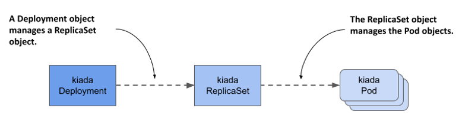
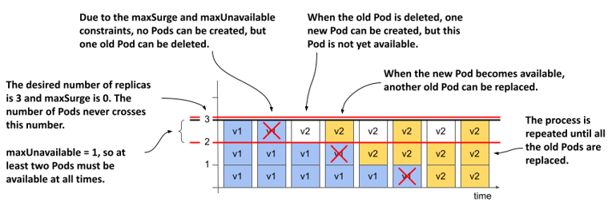
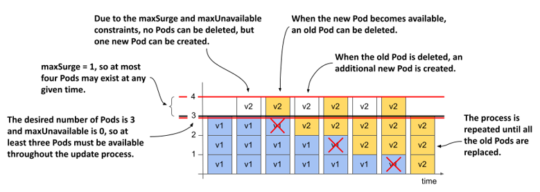
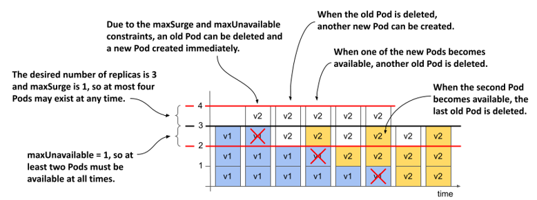

# Lab 03: Deployments



## Create Deployments

- deploy.hello-api.yml

```yaml
apiVersion: apps/v1
kind: Deployment
metadata:
  name: hello-api
spec:
  # strategy:
  #   type: RollingUpdate
  #   rollingUpdate:
  #     maxSurge: 1
  #     maxUnavailable: 0
  # minReadySeconds: 10
  replicas: 3
  selector:
    matchLabels:
      app: hello-api
      rel: stable
  template:
    metadata:
      labels:
        app: hello-api
        rel: stable
    spec:
      containers:
        - name: hello-api
          image: hello-api:0.0.1
          ports:
            - containerPort: 3000
          imagePullPolicy: IfNotPresent
```

```sh
kubectl apply -f deploy.hello-api.yml
```

### Display Resources

```sh
kubectl get pod
kubectl get pod -o wide
kubectl get replicasets # rs
kubectl get deployments # deploy
```

```sh
kubectl describe pod
kubectl describe replicasets # rs
kubectl describe deployments # deploy
```

## Scale Pod via Deployments

```sh
kubectl scale deploy hello-api --replicas 5
```

## Upgrade Image Version

- deploy.hello-api.yml

```diff
...
    spec:
      containers:
      - name: hello-api
-       image: hello-api:0.0.1
+       image: hello-api:0.0.2
        ports:
        - containerPort: 3000
        imagePullPolicy: IfNotPresent
```

## Configuring how many Pods are replaced at a time

1. Introducing the maxSurge and maxUnavailable configuration options

   The two parameters that affect how fast Pods are replaced during a rolling update are `maxSurge` and `maxUnavailable`, which I mentioned briefly when I introduced the RollingUpdate strategy.

   ```yaml
   spec:
     strategy:
       type: RollingUpdate
       rollingUpdate:
         maxSurge: 0
         maxUnavailable: 1
   ```

   | Property       | Description                                                                                                                                                                                                            |
   | -------------- | ---------------------------------------------------------------------------------------------------------------------------------------------------------------------------------------------------------------------- |
   | maxSurge       | **The maximum number of Pods** above the desired number of replicas that the Deployment **can have during the rolling update**. The value can be an absolute number or a percentage of the desired number of replicas. |
   | maxUnavailable | **The maximum number of Pods** relative to the desired replica count that **can be unavailable during the rolling update**. The value can be an absolute number or a percentage of the desired number of replicas.     |

   MaxSurge=0, maxUnavailable=1

   

   MaxSurge=1, maxUnavailable=0

   

   MaxSurge=1, maxUnavailable=1

   
