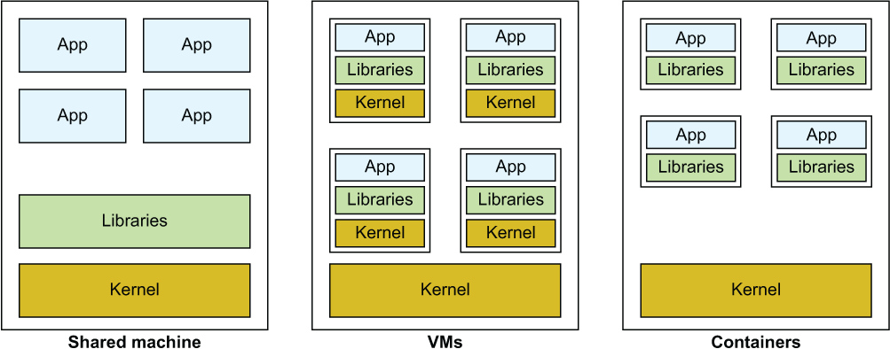
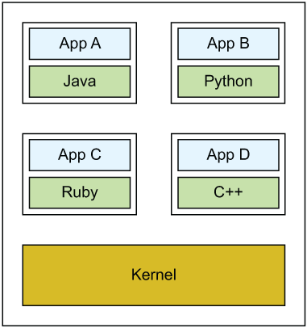
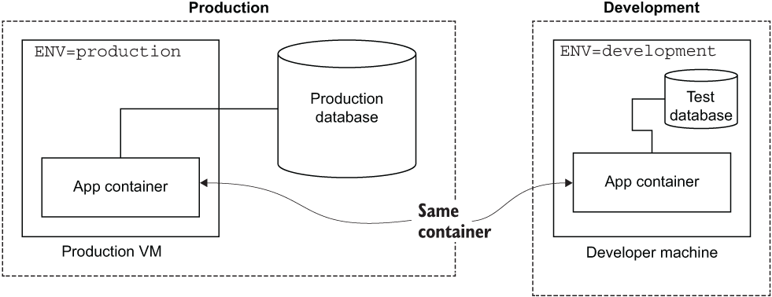
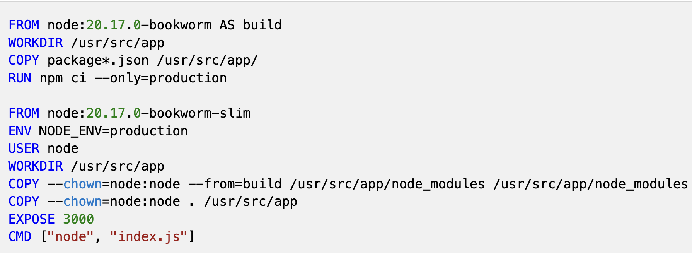
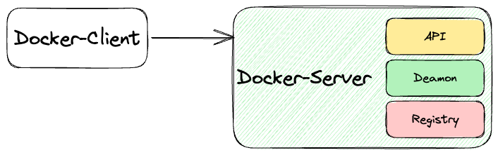
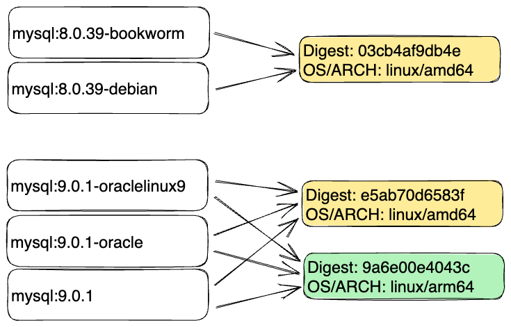
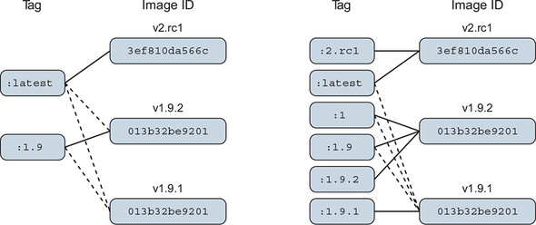

# DEVOPS IN ACTION WORKSHOP: Part I

## Overview: from Docker to Kubernetes

## Why Docker?

## Why Docker Compose?

## Why Kubernetes?

---

## The 12 Factor App([en](12factor_app_for_beginners.md),[th](12factor_app_for_beginners_th.md))

1. Codebase
2. Dependencies
3. Config
4. Backing services
5. Build, release, run
6. Processes
7. Port binding
8. Concurrency
9. Disposability
10. Dev/prod parity
11. Logs
12. Admin processes

---

## Principles of Container-based App Design([en](./container_app_design_for_beginners.md),[th](./container_app_design_for_beginners_th.md))

Visuals include principles:

- Image Immutability
- High Observability
- Process Disposability
- Lifecycle Conformance
- Self-Containment
- Runtime Confinement
- Single Concern

---

## Evolution of Containers



- Shared Machine
- Virtual Machines (VMs)
- Containers

---

## Benefits of Containers

- Language Flexibility
- Isolation Without Overhead
- Developer Efficiency
- Reproducibility

---

### Language Flexibility



---

### Isolation Without Overhead


---

### Developer Efficiency



---

### Reproducibility



---

## Hello, World

```bash
$ docker run hello-world
Unable to find image 'hello-world:latest' locally
latest: Pulling from library/hello-world
c9c5fd25a1bd: Pull complete
Digest: sha256:940c619fbd418f9b2b1b63e25d8861f9cc1b46e3fc8b018ccfe8b78f19b8cc4f
Status: Downloaded newer image for hello-world:latest

Hello from Docker!
This message shows that your installation appears to be working correctly.

To generate this message, Docker took the following steps:
 1. The Docker client contacted the Docker daemon.
 2. The Docker daemon pulled the "hello-world" image from the Docker Hub.
    (arm64v8)
 3. The Docker daemon created a new container from that image which runs the
    executable that produces the output you are currently reading.
 4. The Docker daemon streamed that output to the Docker client, which sent it
    to your terminal.

To try something more ambitious, you can run an Ubuntu container with:
 $ docker run -it ubuntu bash

Share images, automate workflows, and more with a free Docker ID:
 https://hub.docker.com/

For more examples and ideas, visit:
 https://docs.docker.com/get-started/
```

---

## Docker Client & Server



---

## Docker Commands

```bash
$ docker
Usage:  docker [OPTIONS] COMMAND

A self-sufficient runtime for containers

Common Commands:
  run         Create and run a new container from an image
  exec        Execute a command in a running container
  ps          List containers
  build       Build an image from a Dockerfile
  bake        Build from a file
  pull        Download an image from a registry
  push        Upload an image to a registry
  images      List images
  login       Authenticate to a registry
  logout      Log out from a registry
  search      Search Docker Hub for images
  version     Show the Docker version information
  info        Display system-wide information
```

---

## Create Docker Image from Scratch

> [lab01-docker-image-from-scratch](./day1/lab01-docker-image-from-scratch/api)

```bash
cd src && npm install
cd src && npm start
cd ..

docker pull node:22.16-alpine3.22
docker container run --name node node:22.16-alpine3.22
docker container cp ./src node:/root/
docker container commit node hello:0.0.1
docker container run -p 3000:3000 --name hello-api hello:0.0.1 node /root/src/index.js
docker container rm -f hello-api
```

---

## Share Docker Images([en](./dockerhub_url_formats.md),[th](./dockerhub_url_formats_th.md))

Links:

- `https://hub.docker.com/_/dockerhub_username`
- `https://hub.docker.com/u/dockerhub_username`
- `https://hub.docker.com/r/dockerhub_username`

```sh
docker push dockerhub_username/image_name:tag
```

---

## Build Docker Image from Dockerfile

> [lab02-docker-image-by-Dockerfile](./day1/lab02-docker-image-by-Dockerfile/api)

### Dockerfile

```dockerfile
FROM node:22.16-alpine3.22 AS build
WORKDIR /usr/src/app
COPY package*.json /usr/src/app/
RUN npm ci --only=production

FROM node:22.16-alpine3.22
ENV NODE_ENV=production
USER node
WORKDIR /usr/src/app
COPY --chown=node:node --from=build /usr/src/app/node_modules /usr/src/app/node_modules
COPY --chown=node:node . /usr/src/app
EXPOSE 3000
CMD ["node", "index.js"]
```

> Rootless Container([en](./rootless_dockerfile_guide.md), [th](./rootless_dockerfile_guide_th.md))

---

### Commands

1. Change directory

   ```bash
   cd src
   ```

2. Build docker image

   ```bash
   docker image build -t hello:0.0.2 .
   ```

3. Run docker container

   ```bash
   docker container run -e "PORT=3000" -p 3000:3000 --name hello-api hello:0.0.2
   ```

   - `-e "PORT=3000"`: Environment variable to use
   - `-p 3000:3000`: Map port 8080 on your machine to port 80 in the container
   - `--name hello-api`: Give the container a friendly name
   - `hello:0.0.2`: The image to use

4. Remove docker container by name

   ```bash
   docker container rm -f hello-api
   ```

**With dump-init:**

1. Change directory

   ```bash
   cd src
   ```

2. Build docker image

   ```bash
   docker image build -f Dockerfile-dump-init -t hello:0.0.3 .
   ```

3. Run docker container

   ```bash
   docker container run -e "PORT=3000" -p 3000:3000 --name hello-api hello:0.0.3
   ```

4. Remove docker container by name

   ```bash
   docker container rm -f hello-api
   ```

[Quick Tips: Docker & Node.JS](https://dev.to/vapourisation/quick-tips-docker-nodejs-54fm)

---

## Communication via network

---

### Create API and Call Database via Host IP

> [lab03_working_with_database](./day1/lab03_working_with_database/api)

1. Run MySQL Container

   ```bash
   docker container run --rm --name mysql9 \
   -v ./data/:/docker-entrypoint-initdb.d/ \
   -e MYSQL_ROOT_PASSWORD=password \
   -e MYSQL_DATABASE=mydatabase \
   -e MYSQL_USER=admin \
   -e MYSQL_PASSWORD=password \
   -p 3306:3306 \
   -d mysql:9.0.1-oraclelinux9
   ```

   - `-d`: Run in detached mode (background)

2. Run API Container

   ```bash
   docker container run --rm -d --name api \
    -e DB_HOST=<IP>  -e DB_USER=admin \
    -e DB_PASSWORD=password  -e DB_NAME=mydatabase \
    -e DB_PORT=3306  -e PORT=3000 \
    -p 3000:3000  api:0.0.1
   ```

---

### Communication via Docker Network

> [lab04_docker_network](./day1/lab04_docker_network/api)

1. Create network:

   ```bash
   docker network create hello
   docker network ls
   docker network inspect hello
   ```

   ```bash
   docker network rm hello
   ```

2. Start DB with network:

   ```bash
   docker container run --rm --name mysql9 \
   -v ./data/:/docker-entrypoint-initdb.d/ \
   -e MYSQL_ROOT_PASSWORD=password \
   -e MYSQL_DATABASE=mydatabase \
   -e MYSQL_USER=admin \
   -e MYSQL_PASSWORD=password \
   -p 3306:3306 \
   -d mysql:9.0.1-oraclelinux9
   ```

3. API with network

   ```bash
   docker container run --rm -d --name api \
   -e DB_HOST=<IP> \
   -e DB_USER=admin \
   -e DB_PASSWORD=password \
   -e DB_NAME=mydatabase \
   -e DB_PORT=3306 \
   -e PORT=3000 \
   -p 3000:3000 \
   api:0.0.1
   ```

---

## Docker Compose

> [lab05_docker_compose](./day1/lab05_docker_compose/api)

### Example Compose ([YAML](./yaml_tutorial.md))

```yaml
api:
  image: api:0.0.1
  container_name: api
  ports:
    - 3000:3000
  networks:
    - hello
  depends_on:
    db:
      condition: service_healthy
  environment:
    - DB_HOST=db
    - DB_USER=admin
    - DB_PASSWORD=password
    - DB_NAME=mydatabase
    - DB_PORT=3306
    - PORT=3000
```

1. Run docker compose

   ```sh
   docker compose up -d
   ```

   ```sh
   docker compose up -d --force-recreate
   ```

2. Stop docker compose

   ```sh
   docker compose down
   ```

---

## Docker Swarm

---

## Imperative vs Declarative

YAML Build vs CLI commands:

- YAML defines `build`, `context`, `dockerfile`
- CLI uses `docker image build`, `docker run`, `docker stop`

---

## Docker Tags



- MySQL versions & Digests



- Tag schemes (v1.9.2, latest, etc.)

---

## Docker Registry

### Registry Commands

```bash
docker pull registry:2.8.3
docker run -d -p 5000:5000 --restart always --name registry registry:2.8.3
docker tag api:0.0.1 localhost:5000/api:0.0.1
docker push localhost:5000/api:0.0.1
docker image rm api:0.0.1 localhost:5000/api:0.0.1
docker pull localhost:5000/api:0.0.1
```

Resource: [https://distribution.github.io/distribution/](https://distribution.github.io/distribution/)

---

## Security for Docker 101

### Static Scan with Trivy

```bash
trivy image <image>
trivy image api:0.0.1
trivy image --format template --template "@contrib/sarif.tpl" -o report.sarif <image>
```

Resource: [https://aquasecurity.github.io/trivy](https://aquasecurity.github.io/trivy)

---

## Common Commands Reference

---

### Container Operations

```sh
docker run [OPTIONS] IMAGE [COMMAND] # Create and start container
docker start CONTAINER # Start stopped container
docker stop CONTAINER # Stop running container
docker restart CONTAINER # Restart container
docker rm CONTAINER # Remove container
docker exec -it CONTAINER /bin/bash # Execute command in running container
```

---

### Image Operations

```sh
docker build -t NAME . # Build image from Dockerfile
docker pull IMAGE # Download image from registry
docker push IMAGE # Upload image to registry
docker images # List local images
docker rmi IMAGE # Remove image
```

---

### Information Commands

```sh
docker ps # List running containers
docker ps -a # List all containers
docker logs CONTAINER # View container logs
docker inspect CONTAINER # Detailed container info
docker stats # Live resource usage stats
```

---

### Cleanup Commands

```sh
bashdocker system prune # Remove unused containers, images, networks
docker container prune # Remove stopped containers
docker image prune # Remove unused images
docker volume prune # Remove unused volumes
```

---
