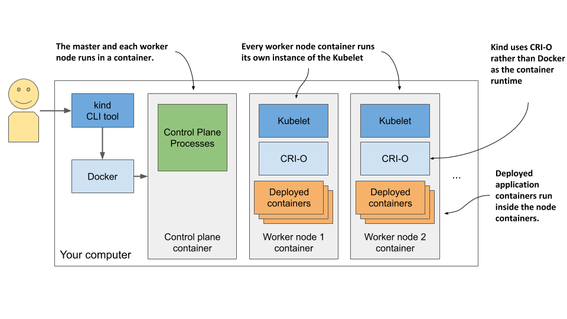
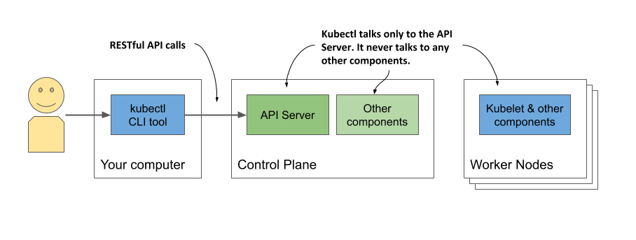
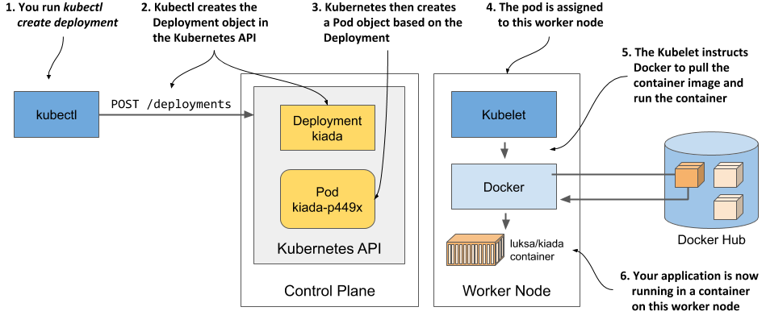

# Kind

1. [Prerequisite](#prerequisite)
2. [Create Cluster with KIND](#create-cluster-with-kind)

---

## Prerequisite

1. [docker](https://www.docker.com/) or [podman](https://podman.io/) or [nerdctl](https://github.com/containerd/nerdctl)

## Create Cluster with KIND



1. Installing kind: [https://kind.sigs.k8s.io/docs/user/quick-start/](https://kind.sigs.k8s.io/docs/user/quick-start/)

2. Starting a k8s cluster with kind

   ```sh
   kind create cluster
   kind cluster
   kind get clusters
   kind get nodes
   kind get kubeconfig
   kubectl cluster-info --context kind-kind
   docker image ls | grep kind
   ```

   ```sh
   kind create cluster -n mycluster
   kubectl cluster-info --context kind-mycluster
   ```

   ```yaml
   kind: Cluster
   apiVersion: kind.sigs.k8s.io/v1alpha4
   nodes:
     - role: control-plane
     - role: worker
     - role: worker
   ```

   ```sh
   kind create cluster --config kind-multi-node.yaml
   kubectl cluster-info --context kind-kind
   kind get nodes
   docker ps
   ```

   ```sh
   cat ~/.kube/config
   ```

3. Logging into cluster nodes provisioned by kind

   ```sh
   docker exec -it kind-control-plane bash
   ```

   ```sh
   root@kind-control-plane:/# crictl ps
   ```

## Interacting with Kubernetes



1. Download and install kubectl

   - linux

     ```sh
     curl -LO "https://dl.k8s.io/release/$(curl -L -s https://dl.k8s.io/release/stable.txt)/bin/linux/amd64/kubectl"
     chmod +x kubectl
     sudo mv kubectl /usr/local/bin/
     ```

   - windows

     - [download kubectl.exe](https://storage.googleapis.com/kubernetes-release/release/v1.18.2/bin/windows/amd64/kubectl.exe.)
     - [the lates stable version](https://storage.googleapis.com/kubernetes-release/release/stable.txt)

   - mac

     ```sh
     brew install kubectl
     ```

2. bash-completion

   ```sh
   source <(kubectl completion bash)
   ```

3. Using `kubectl`

   - verifying cluster

     ```sh
     kubectl cluster-info
     ```

   - listing cluster nodes

     ```sh
     kubectl get nodes
     ```

   - retrieving additional details of an object

     ```sh
     kubectl describe node <node-name>
     ```

## Deploying your application

1. Creating the deployment

   ```sh
   kubectl create deployment kiada --image=luksa/kiada:0.1
   ```

   - You want to create a `deployment object`.
   - You want the object to be called `kiada`.
   - You want the deployment to use the container image `luksa/kiada:0.1`.

2. Listing deployments

   ```sh
   kubectl get deployments
   ```

3. Listing pods

   ```sh
   kubectl get pods
   ```

4. describe pods

   ```sh
   kubectl describe pods
   ```



## Exposing your application to the world

### LoadBalancer

1. Create service

   ```sh
   kubectl expose deployment kiada --type=LoadBalancer --port 8080
   ```

2. Running the [cloud-provider](https://kind.sigs.k8s.io/docs/user/loadbalancer/)

   ```sh
   cloud-provider-kind -enable-lb-port-mapping
   ```

### Port Forward


```sh
kubectl port-forward <resource-type>/<resource-name> <local-port>:<pod-port>
```

#### Common examples

```sh
kubectl port-forward pod/<pod name> 8080:8080
kubectl port-forward service/<service name> 8080:8080
kubectl port-forward deployment/<app name> 8080:8080
```

#### Advanced options

```sh
kubectl port-forward --address 0.0.0.0 pod/<pod name> 8080:8080
kubectl port-forward -n <namespace> pod/<pod name> 8080:8080
kubectl port-forward pod/<pod name> 8080:80 8443:443
```

## Horizontally scaling the application

1. Scaling kiada

   ```sh
   kubectl scale deployments kiada --replicas=3
   ```

2. Checking with deployments and pods

    ```sh
    kubectl get deployments
    kubectl get pods
    kubectl get pods -o wide
    ```


---

## References

1. [https://kind.sigs.k8s.io/](https://kind.sigs.k8s.io/)
2. [kubernetes the hard way](https://github.com/kelseyhightower/Kubernetes-the-hard-way)
3. [k8s dashboard](https://kubernetes.io/docs/tasks/access-application-cluster/web-ui-dashboard/)
4. [cloud provider kind](https://github.com/kubernetes-sigs/cloud-provider-kind)
